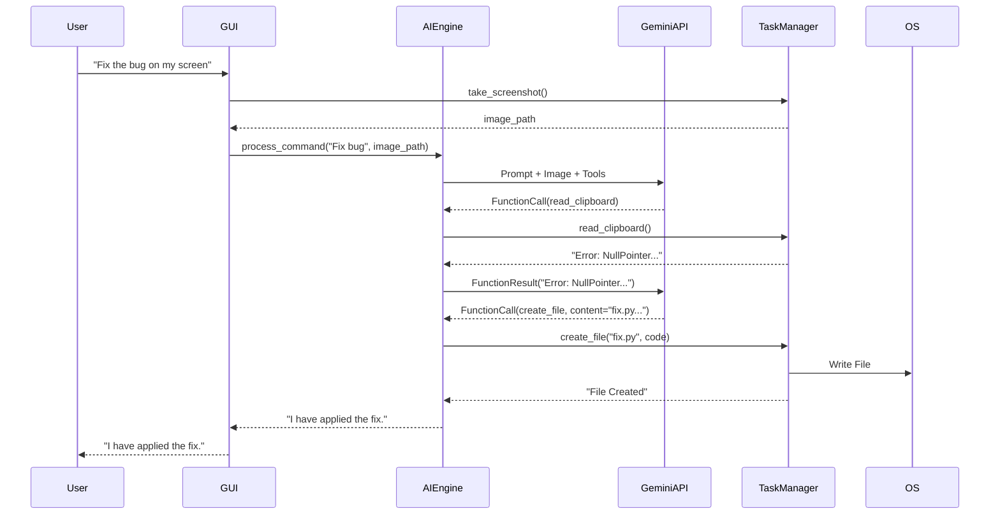

# 🏗️ JarvisAI Technical Architecture

## 1. System Design Overview

JarvisAI is designed as a **Client-Agent System** where the local client handles OS interactions and the cloud agent handles intelligence.

### 1.1 The Control Loop

The core of JarvisAI is the **Decision-Execution-Correction (DEC)** loop:

1.  **Perception:**
    *   **Audio:** Captured via `speech_recognition`, processed by Google Speech API.
    *   **Vision:** Screenshots captured via `pyautogui`, encoded as base64, sent to Gemini 2.0.
    *   **Text:** Direct input via the GUI search bar.

2.  **Decision (Reasoning):**
    *   The orchestrator (`ai_engine.py`) maintains a `history` of the conversation.
    *   It sends a prompt to Gemini 2.0 Flash with a defined **Tool Schema**.
    *   Gemini returns a **Function Call** (JSON) instead of text if an action is required.

3.  **Execution (Action):**
    *   `task_manager.py` maps the function name (e.g., `create_file`) to a Python callable.
    *   Arguments are validated against safety policies.
    *   The action is executed (e.g., `subprocess.run()`).

4.  **Feedback (Correction):**
    *   The output (stdout/stderr) is captured.
    *   If `stderr` is non-empty, it is fed back to the LLM as a new user message: *"Execution failed with error: ..."*.
    *   The LLM generates a fix and triggers a new execution.

---

## 2. Data Flow Diagram

---

## 3. Tool Definitions (Schema)

Jarvis exposes the following tools to the LLM. These are defined in `ai_engine.py` using the Google Generative AI SDK format.

| Tool Name | Arguments | Description |
| :--- | :--- | :--- |
| `run_python_script` | `script_path` | Runs a .py file and returns stdout/stderr. |
| `install_python_library` | `library_name` | Installs a package via pip. |
| `create_file` | `file_path`, `content` | Creates a text file with content. |
| `open_application` | `app_name` | Intelligent fuzzy search for apps. |
| `take_screenshot` | *None* | Returns path to temporary screenshot. |
| `read_clipboard` | *None* | Returns clipboard text. |
| `get_current_time` | *None* | Returns ISO 8601 timestamp. |

---

## 4. Security Model

### 4.1 File System Access Control
*   **Whitelist:** Writes are technically allowed anywhere *except* the Blacklist.
*   **Blacklist:** `C:\Windows`, `C:\Program Files`, `C:\Program Files (x86)`.
*   **Implementation:** `os.path.abspath()` checks against a forbidden prefix list before file creation.

### 4.2 Code Execution Sandbox
*   **Isolation:** Code runs in a child process, not the main thread.
*   **Resource Limits:**
    *   `timeout=10s`: Prevents infinite loops.
    *   `creationflags=subprocess.CREATE_NO_WINDOW`: Prevents popup spam (unless explicitly requested via `ctypes`).

### 4.3 Network Security
*   **API Keys:** Stored in `config.py`. *Note: In a production environment, these should be moved to Environment Variables (`os.environ`).*
*   **Traffic:** All LLM traffic is encrypted via TLS 1.3 (Google API standard).

---

## 5. Scalability & Performance

*   **Concurrency:** The GUI runs on the Main Thread (PyQt). All AI and OS operations are offloaded to `asyncio` event loops or background threads (`threading.Thread`) to prevent UI freezing.
*   **Memory Footprint:** ~150MB RAM (mostly Python runtime + PyQt overhead).
*   **Latency:**
    *   Voice Processing: ~500ms
    *   LLM Inference: ~1-2s (Gemini Flash)
    *   Action Execution: <100ms
